<p align="center">
  
</p>

<p align="center">
  <a href="https://github.com/airingursb/Penelope/actions"></a>
  <a href="https://airingursb.github.io/Penelope/"></a>
  <a href="https://airingursb.github.io/Penelope/play.html"></a>
  <a href="./LICENSE"></a>
</p>

> **Execution is data. A running program is a value.**

Penelope makes pause/resume a **language primitive**, not a framework feature. A program can suspend itself mid-flight, write its complete state to disk, exit the process, and a later — possibly much later — invocation can pick up exactly where it left off, with full bindings and call stack intact.

```pen
let x = 10;
let y = pause;        // process exits, state saved to disk
print(to_str(x + y)); // a later process resumes with y = 5, prints 15
```

No `checkpoint`, no `await`, no decorator. Just `let y = pause;`. That is the entire ergonomic claim.

[**Read the docs**](https://airingursb.github.io/Penelope/) · [**Try in browser**](https://airingursb.github.io/Penelope/play.html) · [**Tour**](https://airingursb.github.io/Penelope/tour.html) · [**Debugger**](https://airingursb.github.io/Penelope/debugger.html)

---

## The thesis

In ordinary programming languages, a running program's mid-execution state is **ephemeral**. If the process dies, the state dies with it. The variables on the stack vanish. The half-finished computation is unrecoverable. You either start over, or you write a great deal of supporting code — checkpoint files, queues, retries, idempotency layers — to make the system survive failure.

Modern durable-execution frameworks (Temporal, Inngest, Restate, DBOS) add that infrastructure on top of ordinary languages. They work. They are also constraining: they force users to structure programs around `activity` / `step` / `await` boundaries. The programmer must mentally translate "what I want to do" into "what the framework will let me say."

Penelope dissolves these boundaries by making pause/resume a **language primitive**. The user writes straight-line code. The runtime handles all the durability.

---

## A second example: a 24-hour approval

```pen
print("Requesting approval");
let decision = wait_for("approval");           // process can die here
print("Decision: " + to_str(decision));
let result = net_fetch("https://example.com"); // process can die here
write_file("/tmp/audit.log", result);
print("Audit complete");
```

Run it; the process pauses on `wait_for`. The CI server can restart, the laptop can sleep, the cluster can be redeployed — the snapshot on disk holds the program's complete future. Hours or days later:

```sh
pen resume agent.penz --event approval=true
```

The program resumes. `decision` is bound to `true`. `print("Decision: true")` fires. `net_fetch` runs. If the process dies *again* after that, resuming a second time **replays the fetched response from the effect log** — the network is not hit twice. `write_file` runs exactly once across the whole lifetime, even if the program is resumed ten times.

This is the durable-execution contract you'd get from Temporal — written in a syntax that doesn't know it's durable.

---

## The name

In Homer's *Odyssey*, Penelope waits twenty years for Odysseus to return from the Trojan War. Pressed by a hundred suitors to remarry, she promises she will choose one when she finishes weaving a shroud for Laertes. By day, she weaves. By night, she unweaves what she has done. Year after year, until Odysseus comes home.

The myth maps onto the language:

| Myth | Language |
|---|---|
| Weave | Execute |
| Unweave | Rollback (via fork) |
| Dusk → dawn | Pause / resume |
| Twenty years | Durable execution at any timescale |
| The return | The program eventually completes, correctly |

She didn't have to wait — she *chose* to. A Penelope program does not stall; it deliberately holds its place, because it knows what it is waiting for.

---

## Quick start

```sh
git clone https://github.com/airingursb/Penelope
cd Penelope
npm install && npm run build

# Run a program
bin/penelope run examples/01-toplevel-pause.pen

# Compile to bytecode with -O2
bin/penelope build -O2 examples/09-fib.pen

# Inspect a snapshot
bin/penelope inspect examples/01-toplevel-pause.penz

# Type-check
bin/penelope check examples/08-24h-agent.pen

# Format
bin/penelope fmt examples/10-sort.pen

# Run a doctest
bin/penelope test examples/12-retry-agent.pen

# Drop into a REPL
bin/penelope repl

# Compare optimizer levels on a benchmark
bin/penelope bench examples/09-fib.pen
```

The CLI also supports `exec`, `resume`, `fork`, `disasm`, `profile`, `doc`, plus flags `-O0/-O1/-O2`, `--time N`, `--no-replay`, `--event N=V`, `--watch`. See the [CLI reference](https://airingursb.github.io/Penelope/cli.html).

---

## What ships today

| Phase | What | Status |
|---|---|---|
| Phase 1 | Foundations: lexer + parser + step-machine + snapshot | ✅ |
| Phase 2 | Effect system: 8 effects + strings + agent runtime | ✅ |
| Phase 3 | Bytecode VM + 5-pass optimizer + snapshot v3 | ✅ |
| Polish R1 | wait_for value injection · source positions · REPL · LSP | ✅ |
| Polish R2 | list/dict · type checker · profiler · VSCode extension · docs site | ✅ |
| Polish R3 | Rust-style errors · LSP hover · snippets · web playground | ✅ |
| Polish R4 | `pen fmt` · `pen test` · LSP completions + go-to-def · `--watch` · color | ✅ |
| Polish R5 | comment-preserving fmt · `pen doc` · TCO · `--watch` on test/check · VSCode debugger | ✅ |
| Phase 4 | Self-hosting · live editing · time-travel debugger | future |

**Final test count: 385 passing across 35 test files.** Zero production dependencies. Hand-written lexer, recursive-descent parser, stack-based VM, 17 opcodes, optimizer levels `-O0` / `-O1` / `-O2`, snapshot format v3.

---

## Architecture

```
.pen source
   │
   ▼ tokenize          ── lexer.ts (hand-written)
tokens
   │
   ▼ parse             ── parser.ts (recursive descent, Pratt precedence)
AST
   │
   ▼ compile           ── compiler.ts (one case per ASTNode kind)
bytecode (.penc)
   │
   ▼ optimize          ── optimizer.ts + optimizer/{constfold,dce,ic,inline,peephole}.ts
optimized bytecode
   │
   ▼ run               ── vm.ts (stack-based, frame chain, ip-keyed effect log)
VMState ⇄ snapshot v3  ── snapshot.ts (.penz JSON, sha256-pinned)
```

**Sister tooling**:

- `lsp.ts` — Language Server Protocol (hover, completions, go-to-definition, diagnostics)
- `dap.ts` — Debug Adapter Protocol (breakpoints, stack, variables)
- `typecheck.ts` — Static type checker
- `format.ts` — Source formatter
- `doc-gen.ts` — Markdown extraction from `///` comments
- `test-runner.ts` — `// EXPECT:` doctest harness
- `diagnostic.ts` — Rust-style error formatting
- `vscode-extension/` — Full editor integration

---

## The effect log

Every side-effect — `print`, `net_fetch`, `now`, `random_int`, `read_file`, `write_file`, `wait_until`, `wait_for` — flows through the **effect log** captured in the snapshot. On resume, completed effects are *replayed from the log*; they don't re-execute. This guarantees idempotency across pause boundaries.

```
$ pen run examples/08-24h-agent.pen
Requesting approval for $5000
paused at ip 12 → examples/08-24h-agent.penz

$ pen resume examples/08-24h-agent.penz --event approval=true
Decision received: true
LLM processed
paused at ip 27 → examples/08-24h-agent.penz

$ pen resume examples/08-24h-agent.penz
Audit logged
# Earlier prints are NOT repeated. net_fetch is NOT re-called.
```

---

## Examples

- `examples/01-toplevel-pause.pen` — top-level pause survives across processes
- `examples/02-nested-pause.pen` — closure captures survive across resume
- `examples/03-fork.pen` — two futures from one snapshot
- `examples/05-net-fetch.pen` — HTTP recorded once, replayed on resume
- `examples/06-time.pen` — `now()` deterministic via effect log
- `examples/07-wait-for.pen` — external event injection
- `examples/08-24h-agent.pen` — 24h HITL agent crashes twice, completes correctly
- `examples/09-fib.pen` — recursive fib benchmark
- `examples/10-sort.pen` — bubble sort on lists
- `examples/11-bfs.pen` — BFS over a dict-based graph
- `examples/12-retry-agent.pen` — multi-attempt agent with `wait_for`

---

## Project layout

```
src/                  Penelope implementation (TypeScript, zero deps)
bin/                  Shell launchers (penelope, penelope-lsp, penelope-dap)
docs/                 Specs, plans, internal references
docs-site/            Public documentation site (deployed via GitHub Pages)
examples/             .pen sample programs
test/                 Vitest test suite
vscode-extension/     Full VSCode extension (syntax, LSP, debugger, snippets)
scripts/              Build helpers (playground bundler, etc.)
assets/               Logo and other static assets
```

---

## License

MIT.

---

<p align="center"><sub>Built with discipline. Tested in a single session. <a href="https://github.com/airingursb/Penelope">github.com/airingursb/Penelope</a></sub></p>
